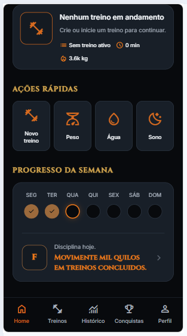
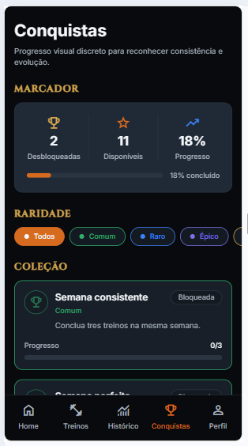
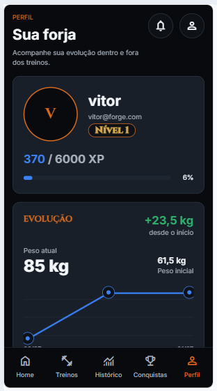
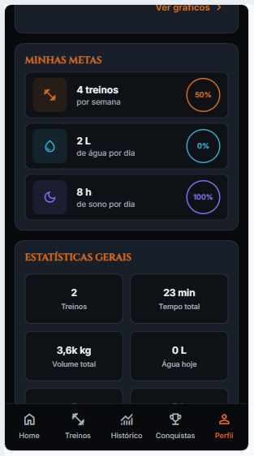

# Forge Mobile

Aplicativo mobile-first do ecossistema **Forge**, desenvolvido em **React Native (Expo)** e **TypeScript**, focado em acompanhamento de treinos, evolução física e gamificação.

---

## ✨ Principais Funcionalidades

- 🏋️ Registro de treinos
- 📈 Sistema de XP
- 🛡️ Evolução do Guardião
- 🏆 Conquistas
- 📊 Histórico de treinos
- 👤 Perfil do usuário
- 🔄 Integração em tempo real com a Forge.Api

---

<p align="center">
  
  
</p>

### Home

<p align="center">
  
  
</p>

### Treinos

<p align="center">
  
  
  
</p>

### Conquistas

<p align="center">
    
</p>

### Histórico

<p align="center">
  
  
</p>

### Perfil

<p align="center">
  
  
</p>

---

## 🏗️ Arquitetura

```

Forge Mobile
│
├── Expo
├── React Native
├── TypeScript
│
▼
Forge.Api (.NET 8)
│
▼
SQL Server

```

---

## 🚀 Tecnologias

| Tecnologia | Uso |
|------------|-----|
| React Native | Interface Mobile |
| Expo | Runtime |
| TypeScript | Linguagem |
| Expo Router | Navegação |
| Axios | Comunicação HTTP |
| ASP.NET Core | API |
| SQL Server | Banco de Dados |

---

## ⚙️ Configuração do ambiente

O Forge Mobile utiliza variáveis públicas do Expo para definir a URL da API e o perfil utilizado durante o desenvolvimento.

Copie o arquivo `.env.example` para `.env` e preencha as informações:

```env
EXPO_PUBLIC_API_BASE_URL=
EXPO_PUBLIC_USER_PROFILE_ID=
```

Exemplo:

```env
EXPO_PUBLIC_API_BASE_URL=https://localhost:7170/api
EXPO_PUBLIC_USER_PROFILE_ID=seu-guid-do-usuario
```

O aplicativo aceita a URL base com ou sem `/api`; o cliente HTTP normaliza automaticamente o endereço.

### Ambiente de desenvolvimento

#### Expo Web

```env
EXPO_PUBLIC_API_BASE_URL=https://localhost:7170/api
```

#### Android Emulator

```env
EXPO_PUBLIC_API_BASE_URL=https://10.0.2.2:7170/api
```

Caso o certificado HTTPS local não seja aceito:

```env
EXPO_PUBLIC_API_BASE_URL=http://10.0.2.2:5113/api
```

#### Dispositivo físico

Utilize o IPv4 da máquina onde a Forge.Api está sendo executada.

```env
EXPO_PUBLIC_API_BASE_URL=http://192.168.0.100:5113/api
```

Após alterar o arquivo `.env`, reinicie o Expo:

```bash
npx expo start -c
```

---

## ▶️ Executando o projeto

### 1. Instalar dependências

```bash
npm install
```

### 2. Iniciar a Forge.Api

```bash
dotnet run --project src/Forge.Api --launch-profile https
```

### 3. Executar o Forge Mobile

```bash
npx expo start
```

Para abrir no navegador:

```text
Pressione W
```

Ou execute diretamente:

```bash
npm run web
```

---

## 🧪 Comandos úteis

```bash
npm install
npm run web
npx expo start
npx tsc --noEmit
npm run lint
```

---

## 📋 Comandos úteis

```bash
npm install
npx expo start
npx tsc --noEmit
npm run lint
```

---

## 📌 Roadmap

- [x] Sistema de autenticação
- [x] Home dinâmica
- [x] Histórico
- [x] Conquistas
- [x] Perfil
- [ ] Estatísticas avançadas
- [ ] Notificações
- [ ] Dashboard expandido